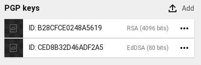
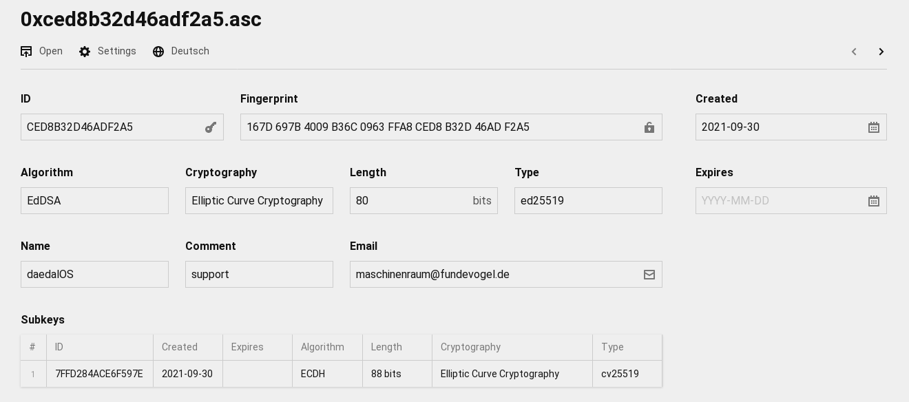

# Kirby3 GnuPG
[](https://github.com/Fundevogel/kirby3-gnupg/releases) [](https://github.com/Fundevogel/kirby3-gnupg/blob/main/LICENSE) [](https://github.com/Fundevogel/kirby3-gnupg/issues)

This plugin adds information about PGP public keys on upload, using `gpg` binary (which needs to be installed for this to work).


## Getting started

Use one of the following methods to install & use `kirby3-gnupg`:


### Git submodule

If you know your way around Git, you can download this plugin as a [submodule](https://github.com/blog/2104-working-with-submodules):

```text
git submodule add https://github.com/Fundevogel/kirby3-gnupg.git site/plugins/kirby3-gnupg
```


### Composer

```text
composer require fundevogel/kirby3-gnupg
```


### Clone or download

1. [Clone](https://github.com/Fundevogel/kirby3-gnupg.git) or [download](https://github.com/Fundevogel/kirby3-gnupg/archive/main.zip) this repository.
2. Unzip / Move the folder to `site/plugins`.


## Usage

Upon file upload / replacement, information on public keys (= `.asc` files) are filled in automatically.

For convenience, the [section blueprint](https://getkirby.com/docs/reference/panel/sections/files) `sections/pubkeys` as well as the [file blueprint](https://getkirby.com/docs/reference/panel/blueprints/file) `files/pubkey` are included so you can jump right in. They look like this:

**Files section:**




**File blueprint:**




## Roadmap

- [ ] Add check for `gpg` binary


## License

`kirby3-gnupg` is licensed under the [MIT License](LICENSE), but **using Kirby in production** requires you to [buy a license](https://getkirby.com/buy).


**Happy coding!**


:copyright: Fundevogel Kinder- und Jugendbuchhandlung
